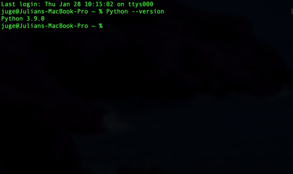
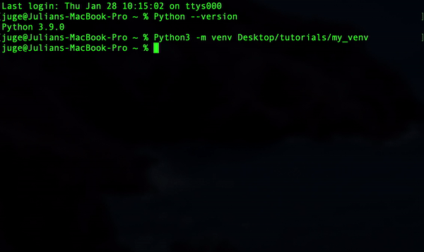
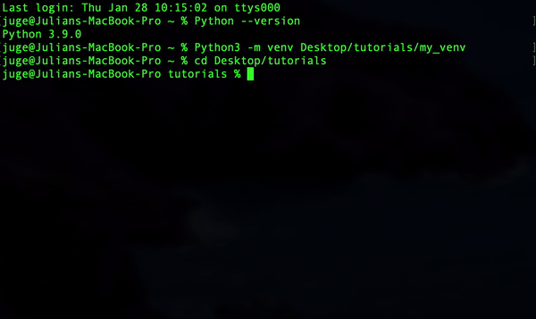
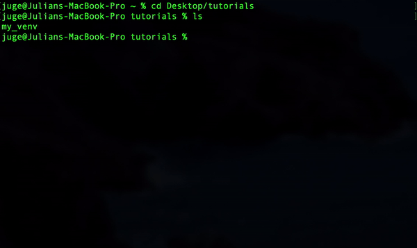
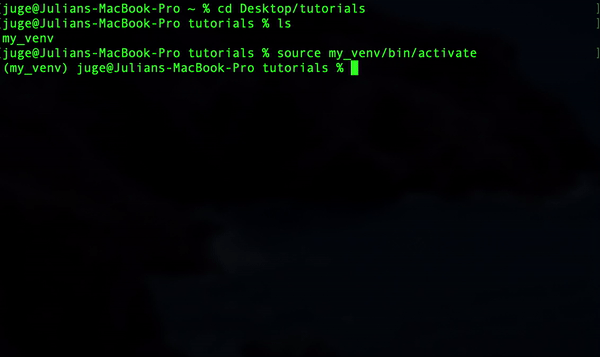
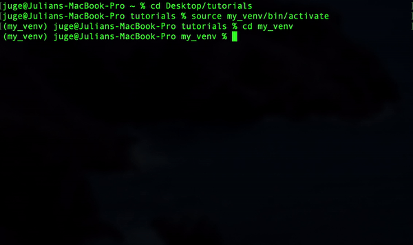
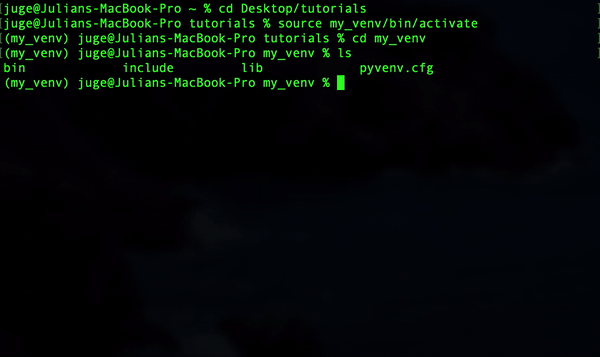
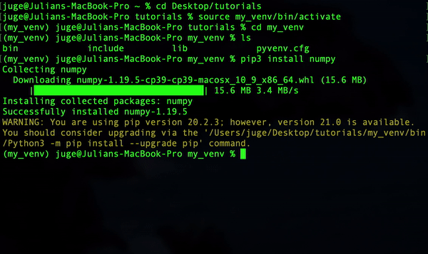

# Python Virtual Envirements
### _If you are a frequent Python user you have likely encountered issues handling package dependancies. Luckily virtual envirement allow users to manage multiple combinations of packages without affecting the main global instillation. In this tutorial you will learn how to create and manage differnet environments with the lightweight package `venv`._ 
#
# Instructions
## 1. Make sure Python is installed
* Use command `Python --version` to determine which Python verison is installed on your local device
### Windows users
* Open Windows Command Prompt
### Mac OS / Linux
* Open Terminal 
## 
## 2. Create a new virtual envirement
* Specify a path and name for your new envirement.
* `Python3 -m venv path/to/my_env`
## 
## 3. Enter workspace of new envirement
* use `cd` and type a `file path` to enter a new directory.
## 
## 4. Make sure everything is in place
* `ls` shows contents of current directory.
## 
## 5. Activate your envirement
* use the `source <venv>/bin/activate` command to activate your envirement.
## 
## 6. Enter virtaul envirement 
* type `cd` and specify a `file path` to enter a new directory.
## 
## 7. View changes
* use `ls` to show contents of current directory.
* _note the folders and .config file generated by the venv module_
## 
## 8. Install a package
* install any packages in your new envirement.
* use `pip` or `pip3 install` if using Python3.
## 
## 9. Deactivate the envirement
* use the command `deactivate` to exit the envirement.
* now you're back to your global packages!
## 
# _That's it. Enjoy!_
